<picture>
  <source media="(prefers-color-scheme: dark)" srcset="assets/banner.svg">
  <source media="(prefers-color-scheme: light)" srcset="assets/banner-light.svg">
  
</picture>

### Hi, I'm Akash Lodhi 👋
**Full Stack Developer | MERN Stack Developer**

_Building scalable web applications with modern technologies._

 

  

 

## 👨‍💻 About Me

- 🔭 I'm a **Full Stack Developer** specializing in the **MERN stack**, building scalable, production-ready web applications end to end.
- 🌱 Currently deepening my knowledge of advanced backend architecture, system design, and API performance.
- 💡 I enjoy turning complex problems into clean, maintainable code and intuitive user experiences.
- 🤝 Open to collaborating on full-stack projects, open-source contributions, and interesting engineering challenges.
- 📫 Reach me at **akashlodhi928@gmail.com** — always happy to talk code, architecture, or new ideas.
- ⚡ Fun fact: my ideal day is `Code → Learn → Build → Repeat`.

 

## 🛠️ Tech Stack

**Languages & Core**

**Frontend**

**Backend**

**Database & APIs**

**Tools & Platforms**

 

## 🚀 Featured Projects

<table>
  <tr>
    <td width="50%">
      <h3>🔗 Project One</h3>
      
A full-stack MERN application with authentication, real-time updates, and a scalable REST API.

      

        
        
        
      

    </td>
    <td width="50%">
      <h3>🔗 Project Two</h3>
      
A Next.js powered platform with JWT authentication, Cloudinary media handling, and a Tailwind CSS interface.

      

        
        
        
      

    </td>
  </tr>
  <tr>
    <td width="50%">
      <h3>🔗 Project Three</h3>
      
A real-time chat / collaboration tool built with Socket.IO, Express, and a Redux Toolkit powered frontend.

      

        
        
        
      

    </td>
    <td width="50%">
      <h3>🔗 Project Four</h3>
      
A Django REST Framework backend serving a data-driven dashboard with secure, documented APIs.

      

        
        
        
      

    </td>
  </tr>
</table>

 

## 📊 GitHub Stats

  

 

## 🧩 Most Used Languages

  

 

## 🏆 GitHub Trophies

  

 

## 🐍 Contribution Snake

<picture>
  <source media="(prefers-color-scheme: dark)" srcset="https://raw.githubusercontent.com/Akashlodhi928/Akashlodhi928/output/github-contribution-grid-snake-dark.svg">
  <source media="(prefers-color-scheme: light)" srcset="https://raw.githubusercontent.com/Akashlodhi928/Akashlodhi928/output/github-contribution-grid-snake.svg">
  
</picture>

 

## 🤝 Connect With Me

 

### 👁️ Profile Views

 

**Keep Coding · Keep Learning · Keep Growing**

Made with ❤️ by **Akash Lodhi**

